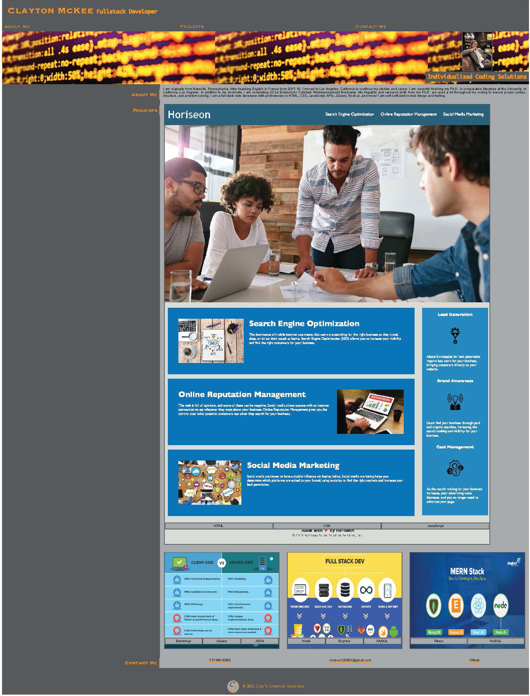

# Clayton McKee's Fullstack Developer Portfolio

## Description

This site was created in order to showcase my work as a web developer. It will continue to be added upon as I take on new projects and further develop my skills. The page supplies potential clients/employers about me, the type of projects in which I've been involved (including links to the projects), as well as ways to contact me or take a look at my Github page. The site itself also shows coding skills in HTML and CSS that are customized to fit my branding. 

## Image of the Site

## Credits

Thanks to Diarmuid Murphy for assistance with coding the hero banner and Matthew Calimbas troubleshooting help. 
